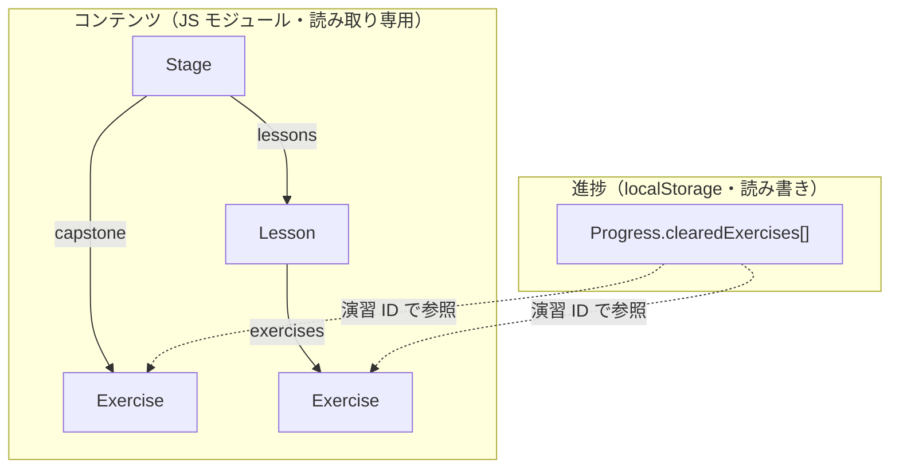

# データモデル設計書（PyLadder）

> spec フロー STEP4 相当。本ツールはDB・サーバを持たない（PRD）。
> よってデータモデルは2つ ―
> (A) コンテンツ・データの型（JS モジュールに格納）、
> (B) localStorage に持つ進捗データ。
> LESSON_DESIGN セクション1のスキーマを実装可能な形に確定する。
> 作成: 2026-05-21

---

## A. コンテンツ・データの型

段ごとの JS モジュール（`content/stage-N.js`）が、以下の形のオブジェクトを
`export` する。型は JSDoc で表現する（TECH_STACK: TS は使わず素 JS ＋ JSDoc）。

### Stage（段）
| フィールド | 型 | 説明 |
|---|---|---|
| `id` | string | 例 `"stage-1"`。一意・不変 |
| `number` | number | 段番号 0〜8 |
| `title` | string | 例 `"numpy — 配列で測定データを扱う"` |
| `intro` | string | 段の導入文（Markdown） |
| `status` | `"active"` \| `"coming-soon"` | ホーム画面の活性/グレーアウト制御。MVP は段1のみ `active` |
| `lessons` | Lesson[] | レッスンの配列（順序＝学習順） |
| `capstone` | Exercise | 卒業課題（`needsDataFile: true`） |

### Lesson（レッスン）
| フィールド | 型 | 説明 |
|---|---|---|
| `id` | string | 例 `"stage-1-lesson-4"`。一意・不変 |
| `title` | string | 例 `"ブール索引 — 悪い測定点を外す"` |
| `explanation` | string | 最小解説（Markdown、5〜10行） |
| `exercises` | Exercise[] | 穴埋め演習の配列（順序＝出題順） |

### Exercise（演習）
| フィールド | 型 | 説明 |
|---|---|---|
| `id` | string | 例 `"stage-1-lesson-4-ex-2"`。一意・不変。進捗が参照するキー |
| `prompt` | string | 問題文 |
| `starterCode` | string | 穴あきコード。空欄は `____`。import を含み1セル完結 |
| `solutionCode` | string | 模範解答。`starterCode` の `____` を埋めた**実行可能な完全コード**。「答えを見る」表示と、`solutionCode`+`test` がパスするかの事前検証に使う |
| `test` | string | 採点コード（`assert` 群） |
| `hints` | string[] | 段階的ヒント（弱→強） |
| `blankLevel` | `"guided"` \| `"partial"` \| `"blank"` | プログレッシブ・ブランク |
| `needsDataFile` | boolean (optional) | `true` なら `.phot.txt` 投入が必要（卒業課題） |

### ID 規約（DB のキー設計に相当）
- 段: `stage-{N}`
- レッスン: `stage-{N}-lesson-{M}`
- 演習: `stage-{N}-lesson-{M}-ex-{K}`
- 卒業課題: `stage-{N}-capstone`

ID は**一意かつ不変**。進捗データ（B）が演習 ID を参照するため、後から ID を変えると
進捗が外れる。コンテンツは木構造（段→レッスン→演習）だが、ID で素早く引けるよう、
アプリ起動時に `Map<exerciseId, Exercise>` を1つ構築する（DB インデックスに相当）。

### Stage モジュールの例
```js
// content/stage-1.js
export const stage1 = {
  id: "stage-1",
  number: 1,
  title: "numpy — 配列で測定データを扱う",
  intro: "測光データは数値の列。numpy 配列で…",
  status: "active",
  lessons: [
    {
      id: "stage-1-lesson-4",
      title: "ブール索引 — 悪い測定点を外す",
      explanation: "…研究での出番: 誤差の大きい点を除外する。",
      exercises: [
        {
          id: "stage-1-lesson-4-ex-2",
          prompt: "誤差 err が 0.1 未満の点だけ good に入れよう。",
          starterCode: `import numpy as np\n...\nmask = ____\ngood = mag[____]`,
          solutionCode: `import numpy as np\n...\nmask = err < 0.1\ngood = mag[mask]`,
          test: `assert good.tolist() == [18.2, 17.9, 18.3]`,
          hints: ["まず True/False の配列を作る…", "…", "答え: …"],
          blankLevel: "guided",
        },
      ],
    },
  ],
  capstone: { id: "stage-1-capstone", needsDataFile: true, /* … */ },
};
```

### エラー読解ガイド（errorGuide）

LESSON_DESIGN のエラー読解ガイドは段・レッスンに属さない**段横断の共通コンテンツ**。
独立モジュール `content/error-guide.js` が「例外型 → 読み方」のマップを `export` する。

| 形 | 説明 |
|---|---|
| `Record<string, string>` | キー＝例外型名（`"NameError"` 等）、値＝読み方のガイド文 |

例外発生時、エンジンは `errorGuide[例外型]` を traceback と並べて表示する（SCREENS S3）。

---

## B. 進捗データ（localStorage）

進捗はブラウザの localStorage に1キーで保存する（TECH_STACK）。

- **キー**: `pyladder:progress`（`pyladder:` プレフィクスで名前空間化）
- **値**: 下記 JSON 文字列

| フィールド | 型 | 説明 |
|---|---|---|
| `schemaVersion` | number | 進捗データの版数。将来のマイグレーション用 |
| `clearedExercises` | string[] | 採点に合格した演習 ID の配列 |
| `lastVisited` | string \| null | 最後に開いた段／レッスンの ID（再開用） |
| `updatedAt` | string | 最終更新（ISO 8601） |

```json
{
  "schemaVersion": 1,
  "clearedExercises": ["stage-1-lesson-4-ex-2", "stage-1-lesson-5-ex-1"],
  "lastVisited": "stage-1-lesson-5",
  "updatedAt": "2026-05-21T12:00:00Z"
}
```

### 派生値（保存しない・計算する）
- 段の進捗率 ＝ `clearedExercises` のうちその段に属する数 ÷ その段の全演習数。
- 段クリア ＝ その段の全演習＋卒業課題が `clearedExercises` に含まれる。
- ホーム画面の各段の進捗表示は、コンテンツ（A）と進捗（B）から都度計算する。

---

## C. データの関係図



---

## D. localStorage 運用上の注意点（DB の RLS 等に相当）

- **容量**: localStorage は1オリジン約5MB。進捗は ID 配列のみで極小 → 問題なし。
- **名前空間**: キーは `pyladder:` プレフィクスで統一し、同一オリジンの衝突を避ける。
- **マイグレーション**: 読み込み時に `schemaVersion` を確認。古い／不正なら**安全に
  初期化**し、壊れた進捗でアプリが起動不能にならないようにする。
- **プライバシー**: 進捗は外部送信しない（PRD）。端末・ブラウザごとに独立し、
  同期しない（多人数共有・サーバ保存は PRD スコープ外）。
- **実データの扱い**: 卒業課題で読み込む `.phot.txt` は Pyodide 仮想FS（メモリ上）に
  のみ置き、**localStorage には保存しない**。

---

## 次工程への申し送り

- **STEP5（CLAUDE.md）**: ディレクトリ構成（`content/` `src/` `docs/` 等）、
  コーディング規約、ローカル起動手順、Claude Code への指示を記す。
