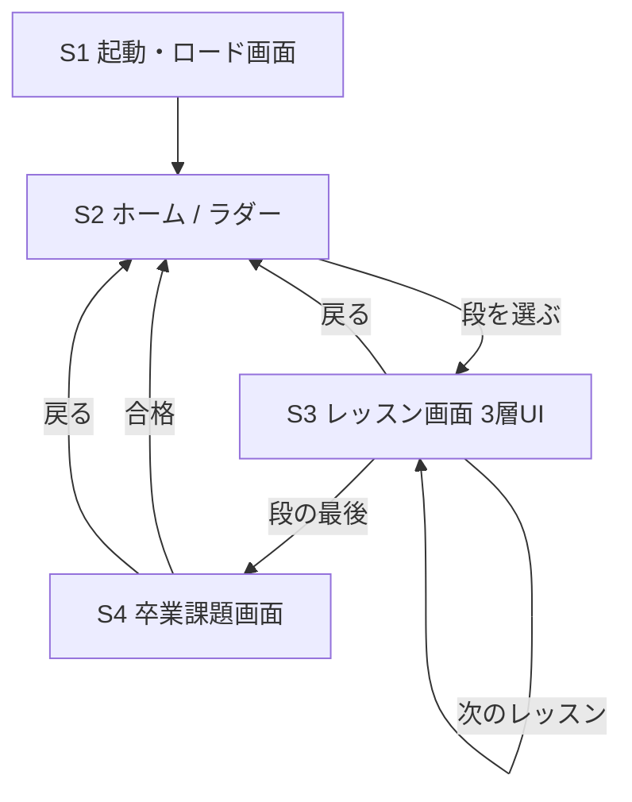

# 画面設計書（PyLadder）

> spec フロー STEP3 相当。PRD・LESSON_DESIGN・TECH_STACK を前提に画面を設計する。
> 本ツールは単一の静的 HTML 内で「ビュー」を切り替える構成（ページ遷移ではない）。
> 認証・ダッシュボード等は無い（PRD スコープ外）ため画面数は少ない。
> 作成: 2026-05-21

---

## 画面一覧

1. 起動・ロード画面（ローディングオーバーレイ）
2. ホーム（ラダー画面）
3. レッスン画面（3層UI）― 中核
4. 卒業課題画面

---

## S1. 起動・ロード画面

- **目的**: Pyodide の初回ロード中（数十MB・十数秒）にユーザーを待たせる間、
  不安を消す。PRD「プログレス表示必須」を満たす。
- **表示要素**:
  - タイトル「PyLadder」とひとことの説明
  - プログレスバー
  - 段階メッセージ（例「Python 環境を準備中…」「numpy を読み込み中…」）
- **ユーザーが行えるアクション**: なし（待つだけ）。完了で自動的にホームへ。
- **遷移先**: ホーム（S2）
- **備考**: 2回目以降はブラウザキャッシュで一瞬。段によっては実際の `import` 時に
  追加ロードが入る（段6 の emcee 等）→ その場面でも小さくプログレスを出す。

## S2. ホーム（ラダー画面）

- **目的**: 全9段の到達ラダーを俯瞰し、現在地と「次の一歩」を示す。
- **表示要素**:
  - 縦に並ぶ段0〜段8のステップ（ラダーの見た目＝到達ラダーのメタファ）
  - 各段: 番号・タイトル・進捗（クリア済み演習数 / 全演習数）
  - 現在取り組める段の強調
  - 進捗リセット（設定）
- **ユーザーが行えるアクション**: 段を選ぶ／進捗をリセットする。
- **遷移先**: レッスン画面（S3）
- **備考**: **MVP では段1のみ活性**。段0・段2〜8 はグレーアウトで「準備中」表示
  （PRD: 段1が縦スライス、他段は後からコンテンツ追加）。

## S3. レッスン画面（3層UI）― 中核

- **目的**: 1レッスンを「解説 → 穴埋め演習」で学ぶ。LESSON_DESIGN の3層構造の
  1・2層目を担う画面。
- **表示要素**:
  - ヘッダ: 段名・レッスン名・段内進捗
  - **第1層 解説**: Markdown 描画（5〜10行、末尾に「研究での出番」一文）
  - **第2層 演習**（複数。1問ずつ）。各演習に:
    - 問題文（`prompt`）
    - コードエディタ（CodeMirror。`starterCode`、空欄 `____`）
    - 「実行」ボタン／「答えを見る」ボタン
    - 結果表示エリア（標準出力・合否・matplotlib 図 PNG）
    - ヒント表示エリア（失敗時に段階開示。例外時は traceback ＋
      エラー読解ガイドを併記）
  - フッタ: 前のレッスン／次のレッスン／ホームへ戻る
- **ユーザーが行えるアクション**: コード編集・実行・採点、ヒントを開く、
  答えを見る、レッスン間を移動する。
- **遷移先**: 次のレッスン（S3）／ホーム（S2）／段の最後なら卒業課題画面（S4）
- **備考**: 各演習は1セル完結（import 含む）。実行は Pyodide の独立した名前空間で
  行い、演習間で状態を持ち越さない（NameError 構造排除）。

## S4. 卒業課題画面

- **目的**: 段の総仕上げ。学んだことを実データ（`.phot.txt`）に適用する
  （LESSON_DESIGN 3層構造の3層目）。
- **表示要素**:
  - 課題説明
  - ファイルのドラッグ＆ドロップ領域（`.phot.txt` → Pyodide 仮想FSへ書き込み）
  - 読み込んだファイル名の表示
  - コードエディタ（CodeMirror）／実行・採点ボタン
  - 結果表示（median / MAD 等の出力）・合格表示
- **ユーザーが行えるアクション**: ファイルを投入する、コードを実行・採点する。
- **遷移先**: 合格でホーム（S2、段クリア表示）／戻るでホーム
- **備考**: ファイル未投入時は実行不可とする。サンプルデータ
  （`研究/dummy_moa.txt` 等）を選べるようにするのは Could（親切機能）。

---

## 画面遷移図

---

## 次工程への申し送り

- **STEP4（データモデル）**: LESSON_DESIGN のスキーマを JS モジュールの型として確定し、
  localStorage に持つ進捗データ（どの演習をクリアしたか）の構造を定義する。
- **STEP5（CLAUDE.md）**: ディレクトリ構成・コーディング規約・ローカル起動手順を記す。
